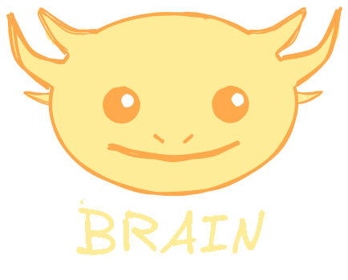

# 🎬 Purposive Communication — Introduction Video

> An animated self-introduction video built entirely with code, created for **Purposive Communication**.

---

## 📋 Overview

This project uses [Manim Community Edition](https://www.manim.community/) to programmatically animate a personal introduction video. Every transition, text reveal, and image fade is written in Python — no video editor required.

The video covers:
- A terminal-style opening sequence
- Personal background and details
- Programming interests (Rust 🦀, Godot, Linux/Windows)
- A showcase of [**Brain**](https://github.com/ASTRALLIBERTAD/Brain) — a custom programming language built from scratch
- Course expectations for Purposive Communication

---

## 🛠️ Prerequisites

Make sure you have the following installed:

- **Python** `3.11+`
- **[uv](https://docs.astral.sh/uv/)** — fast Python package manager
- **System dependencies for Manim** (LaTeX, Cairo, FFmpeg):
  - On Windows: install [MiKTeX](https://miktex.org/), [FFmpeg](https://ffmpeg.org/download.html), and ensure they are on your `PATH`
  - On Linux/macOS: `sudo apt install ffmpeg texlive` (or equivalent)

---

## ⚙️ Setup

### 1. Install uv

One way to install `uv` is via the dedicated console installer supporting all major operating systems. Simply paste the following snippet into your terminal / PowerShell — or consult [uv's documentation](https://docs.astral.sh/uv/) for alternative installation methods.

**macOS and Linux:**
```bash
curl -LsSf https://astral.sh/uv/install.sh | sh
```

**Windows (PowerShell):**
```powershell
powershell -ExecutionPolicy ByPass -c "irm https://astral.sh/uv/install.ps1 | iex"
```

### 2. Install Manim

Installing Manim locally — **Manim Community v0.20.1**

```bash
uv add "manim==0.20.1"
```

Or if setting up from scratch:

```bash
uv init
uv add "manim==0.20.1" pillow numpy svgelements
```

> For additional system-level Manim dependencies (Cairo, Pango, FFmpeg), refer to the [official Manim installation guide](https://docs.manim.community/en/stable/installation.html).

### 3. Clone this repository

```bash
git clone https://github.com/ASTRALLIBERTAD/IntroductionPURCOM.git
cd IntroductionPURCOM
```

### 4. Sync the virtual environment

```bash
uv venv
uv sync
```

### 5. Activate the environment

**Windows (PowerShell):**
```powershell
.venv\Scripts\Activate.ps1
```

**macOS and Linux:**
```bash
source .venv/bin/activate
```

---

## ▶️ Running the Animation

Render the scene using `manim` inside your activated environment:

```bash
# Standard quality (720p)
manim -pql main.py IntroScene

# High quality (1080p)
manim -pqh main.py IntroScene

# Preview only (low quality, fast)
manim -ql --preview main.py IntroScene
```

| Flag | Meaning |
|------|---------|
| `-p` | Auto-play after rendering |
| `-ql` | Low quality (480p, fast preview) |
| `-qm` | Medium quality (720p) |
| `-qh` | High quality (1080p) |
| `--preview` | Open preview window |

The output video will be saved to:
```
media/videos/main/<quality>/IntroScene.mp4
```

---

## 📦 Dependencies

| Package | Purpose |
|---------|---------|
| `manim` | Animation engine |
| `pillow` | GIF frame extraction |
| `numpy` | Frame array manipulation |
| `svgelements` | SVG length utilities |

---

## 🔗 References

<table>
<tr>
<td align="center">
  <a href="https://www.manim.community/">
    <br/>
    <b>Manim Community Edition</b>
  </a><br/>
  <sub>The animation engine powering this entire video.</sub>
</td>
<td align="center">
  <a href="https://github.com/ASTRALLIBERTAD/Brain">
    <br/>
    <b>Brain Programming Language</b>
  </a><br/>
  <sub>A custom programming language built from scratch in Rust, featured in this video.</sub>
</td>
</tr>
</table>

- 📖 [Manim Community Docs](https://docs.manim.community/)
- 🦀 [Brain on GitHub](https://github.com/ASTRALLIBERTAD/Brain)
- ⚡ [uv — Python package manager](https://docs.astral.sh/uv/)

---

## 👤 Author

**Prince Gabrielle Jhon M. Libertad**  
Computer Engineering Student · Polytechnic University of the Philippines  
GitHub: [@ASTRALLIBERTAD](https://github.com/ASTRALLIBERTAD)

---

<p align="center">
  Made with ❤️ and <a href="https://www.manim.community/">Manim</a> · <i>"I created this entire video using code."</i>
</p>
